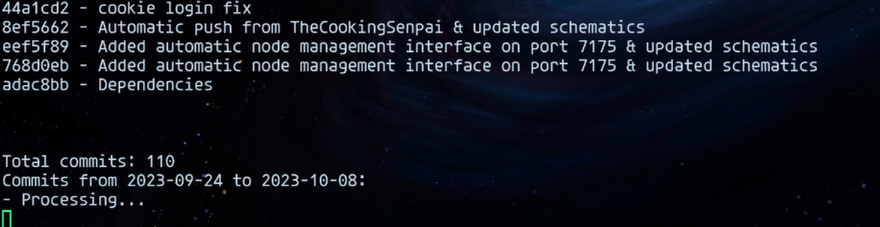

# Devlog



Devlog is a powerful tool that automatically generates (b)log posts from your Git commit history, providing a natural language summary of your development progress.

It uses [ollama](https://github.com/ollama/ollama) to generate the blog posts locally so it never sends your data to third-party servers.

## Requirements

- [ollama](https://github.com/ollama/ollama) capable of running llama3
- [git](https://git-scm.com/)
- [python](https://www.python.org/)

## Description

Devlog retrieves all the commit messages in a repository (local or remote), groups them by customizable time periods, and generates blog posts in natural language. This tool is perfect for developers who want to maintain a development log or changelog without the manual effort of writing blog posts.

## Features

- Supports both local and remote Git repositories
- Customizable time periods for grouping commits
- Natural language generation for readable blog posts
- Output formats: Markdown and HTML
- Skip already processed commits if specified
- Customizable timeframes with cache
- Generate blog posts for each timeframe
- Able to use custom models

## Installation and usage

This project uses [uv](https://github.com/astral-sh/uv) to manage the environment and dependencies.
Please [install it](https://github.com/astral-sh/uv) first.

Once you have uv installed, you can install the dependencies with following commands:

```bash
uv venv
```

## Usage

```bash
uv run src/devlog/__init__.py
```

Alternatively, you can skip the virtual environment and run the script directly with:

```bash
pip install -r requirements.txt
python src/devlog/__init__.py
```

## Configuration

1. Create a `.env` file in the root directory by copying the `env.example` file and set the following environment variables:

```bash
OLLAMA_URL=<your-local-ollam-url>
GIT_REPO=<your-repo-path-or-url>
GIT_TOKEN=<your-git-token>
DEFAULT_BRANCH=<your-default-branch>
GROUP_COMMITS_DAYS=<number-of-days-to-group-commits>
SKIP_PROCESSED_COMMITS=<true-or-false>
OLLAMA_MODEL=<your-ollama-model>
```

2. Copy the `timeframes_config.json.example` file to `timeframes_config.json` and modify the timeframes as you wish.

### .env file guide

- `OLLAMA_URL`: The URL of your local ollama instance or the public instance I'm hosting.
- `GIT_REPO`: The path to your local repository or the URL of the remote repository.
- `GIT_TOKEN`: The token to access the remote repository if it's private.
- `DEFAULT_BRANCH`: The default branch of your repository.
- `GROUP_COMMITS_DAYS`: The number of days to group commits.
- `SKIP_PROCESSED_COMMITS`: Whether to skip already processed commits.
- `OLLAMA_MODEL`: The model to use for generating blog posts.


### timeframes_config.json guide

- `start_date`: The start date of the timeframe.
- `end_date`: The end date of the timeframe.
- `use_cache`: Whether to use the cache to speed up the process.
- `grouping_days`: The number of days to group commits.

Example:

```json
      {
        "start_date": "2024-09-01",
        "end_date": "2024-09-30",
        "use_cache": true,
        "grouping_days": 7
      }
```

## License

This project is licensed under the WTFPL License. See the `LICENSE` file for more details.